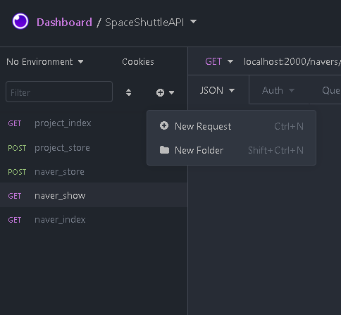
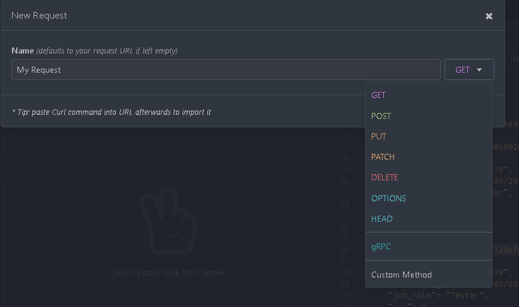
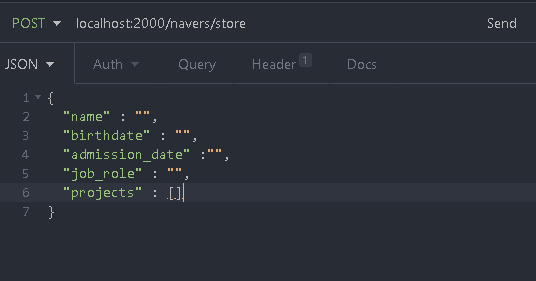
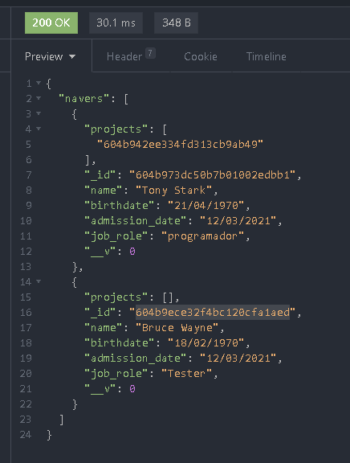

<h1 align="center">Space Shuttle API</h1>

API para controle de equipes e projetos -- teste estágio Nave

<h3>Conteúdo</h3>

 
<a href="#func">Funcionalidades</a>
<a href="#prereq">Pré-requisitos</a> ||
<a href="#app">Rodando a aplicação</a>||
<a href="#test">Testando rotas</a>||
<a href="#tecs">Tecnologias</a> ||
<a href="#lic">Licença</a> ||
<a href="#autor">Autor</a>

<h4 align="center"> 
	:wrench: :hammer: Status:  em andamento
</h4>

<h3 id="func"> Funcionalidades </h3>
<ol>
<ul>[x] Cadastro de membros de equipes (Navers)</ul>
<ul>[x] Listagem de membros de equipes</ul>
<ul>[x] Cadastro de projetos</ul>
<ul>[x] Listagem de projetos</ul>
<ul>[ ] Cadastro de equipes</ul>
<ul>[ ] Autenticação</ul>
<ul>[ ] Agendamento e controle de datas de projetos </ul>
</ol>

<h3 id="prereq">Pré-requisitos</h3>

Você precisará instalar as seguintes ferramentas: 

-> ➡️NodeJS 

-> ➡️MongoDB 

-> ➡️Mongoose 

Entry Point: index.js

Porta do servidor: 2000

<h3 id="app">Para rodar a aplicação: </h3>
<ol>
  <ul>Clone ou baixe esse repositório para sua máquina</ul>
  <ul>Abra a pasta do projeto</ul>
  <ul>Instale as dependências do projeto - nmp install</ul>
  <ul>Através do terminal, rode a aplicação através do Node:<h5> node index.js</h5> ou se você utilizar o Nodemon: <h5>nodemon index.js</h5></ul>
</ol>

Agora, basta acessar: http://localhost:2000/

<h3 id="test">Testando as rotas</h3>
Como sugestão, você pode utilizar a plataforma do Insomnia (Cliente de API) para testar se está tudo ok. 

<a href="https://insomnia.rest/download">Download</a>

Após download e instalação, você pode começar criando a primeira requisição da API: 

<h1 align="center">
  
</h1>

Após criar a request com o nome desejado, você irá acessar o painel superior, onde deve informar a URL da requisição, de acordo com 
a rota definida na API. Atente-se ao tipo de requisição (GET, POST, PUT...). Exemplo: localhost:2000/navers/index

<h1 align="center">
  
</h1>

Agora que a URL foi criada, você pode enviar a requisição. No caso de inserções de dados, você poderá fazer isso no painel abaixo
da URL, definindo o tipo de dado que será usado. No caso desta API, usaremos JSON: 

<h1 align="center">
  
</h1>

Depois de clicar em SEND, você pode conferir o retorno e o status da requisição no painel à direita

<h1 align="center">
  
</h1>

<h3 id="tecs">Ferramentas e tecnologias</h3>
<ol>

Obrigatório

  <ul>NodeJS</ul>
  <ul>Express</ul>
  <ul>MongoDB</ul>
  <ul>Mongoose</ul>
 
Opcional

  <ul>Insomnia OU Postman</ul>
  <ul>Nodemon</ul>
</ol>

<h3 id="lic">Licença</h3>
  MIT License (Acesse o arquivo LICENSE) 
<h3 id="autor">Autor</h3>
<h6 color:red>Julie Santiago</h6>
====================================================================

<h5>➡️CodeSandbox</h5>

<a href="https://codesandbox.io/s/teste-estagio-template-forked-qvdtj?file=/index.html">Exercícios de lógica</a>

